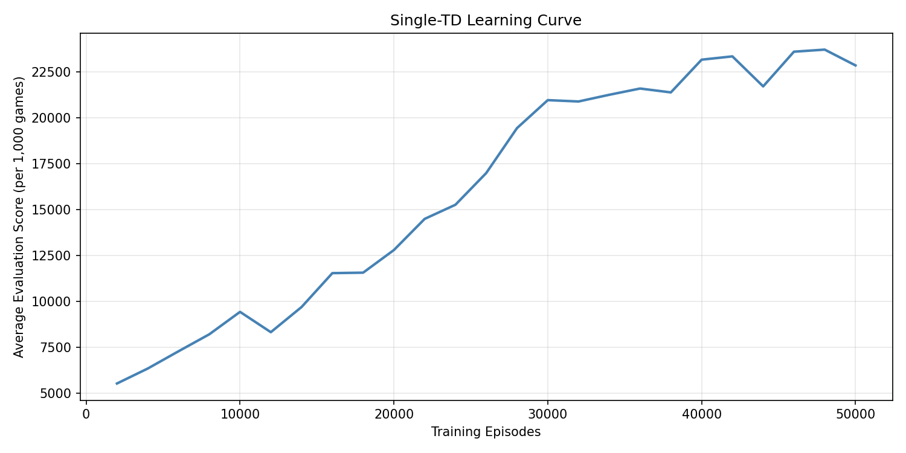
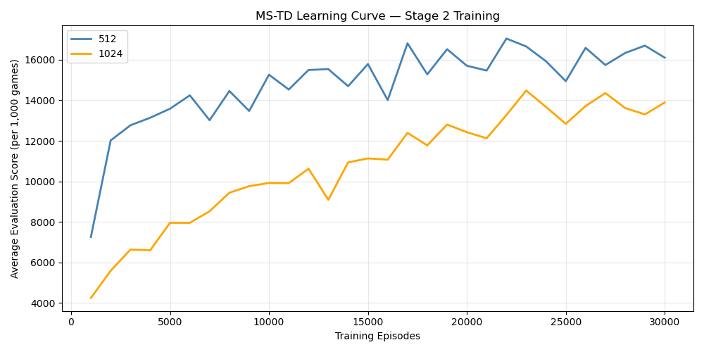

# Evaluating effectiveness of Multi Stage TD Agents

## Project Overview and Scope

The purpose of this project was to try and recreate this [Paper](https://arxiv.org/abs/1606.07374) and use a multi stage temporal difference learning to play 2048, showing it could push far beyond 2048 and reach higher tiles and larger average scores. 

## Running the Models 
If you have Make installed in your local machine You can run the these models after cloning this repo using these commands in your terminal

For the Single Stage Agent use
```
make SingleStage
```

or reproduce the Multi-Stage TD Network with 

```
make Multistage
```

You can Reproduce the graphs in this Readme using 

```
make Graphs
```

If you do not have make (or would like to adjust run amounts, boundaries or other parameters) Run either td0_agent.py multistage.py located in the src file. 

**WARNING: The Single Stage runs 50,000 training episodes while multi stage runs 30,000 training episodes per stage(2)-This takes over 6 hours to run**

## Outputs 
To see the outputs of my original run so you dont have to watch it for hours, please refer to [This Document](output.md) which provides all the completed runs on my computer along with the general time and space they took.  This is particuarly interesting in comparing when each run got to 2048/how long it took and how many games were able to get beyond that 

You can also refer to [This folder](outputs/) if you would like to start from a certain run or see any of the benchmarks that were printed. 

You can adjust [this code](src/graphs.py) with the outputs of your training runs to reproduce the figures below to see how training increased the overall scores.
We see a sharp increase and continual gain until about 40,000 runs, where it starts bouncing more. 

 
 We can see the difference in the boundary with 
 

 This was interesting as the general shape stayed the same where the 512 boundary outperformed the 1024 boundary rather considerably.

## Next Steps 
While my project was not as successful as I would have hoped I believe it has potential with more time or a higher powered machine.
Next Steps include 
* Adding a multi-ply expectimax model instead of a 1-ply looking further into possible next steps. 
* Run significantly more training runs. The paper I was modeling this off of ran many hundreds of thousands while I ran 30k, a significant downgrade 
* To stay consistent with the paper add another boundary so it does 3 training stages, not just cut the game into 2. 
* Unfreeze stage 2 to  allow the 2 stages to train concurrently. This would let Stage 2 correct its own errors rather than permanently baking its biases into Stage 1's learning signal. 
